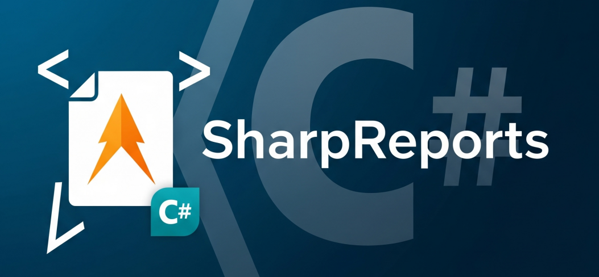

# Sharp Reports

**Sharp Reports** is a flexible, high-performance, and cross-platform reporting library for .NET.  
It leverages the reliability of established open-source document-generation engines Like MigraDocs to provide **beautiful** and **robust** PDF reports for web, desktop, or console applications.
## Features

- Build reports using a clean, fluent C# API
- **Export reports as PDF** (built-in, no extra setup!)
- Easy to use in your own APIs or applications

---

## Projects

- **SharpReports.Lib**: The core library containing report generation logic.
- **SharpReports.Demo**: A demo application showcasing how to use the library.

## Requirements
- .NET 9.0 or later

## Contributing

Contributions are welcome! Please see [CONTRIBUTING.md](CONTRIBUTING.md) for details.

## License

This project is licensed under the [MIT License](LICENSE).

---

**Made with ❤️ by DevmoonX**
